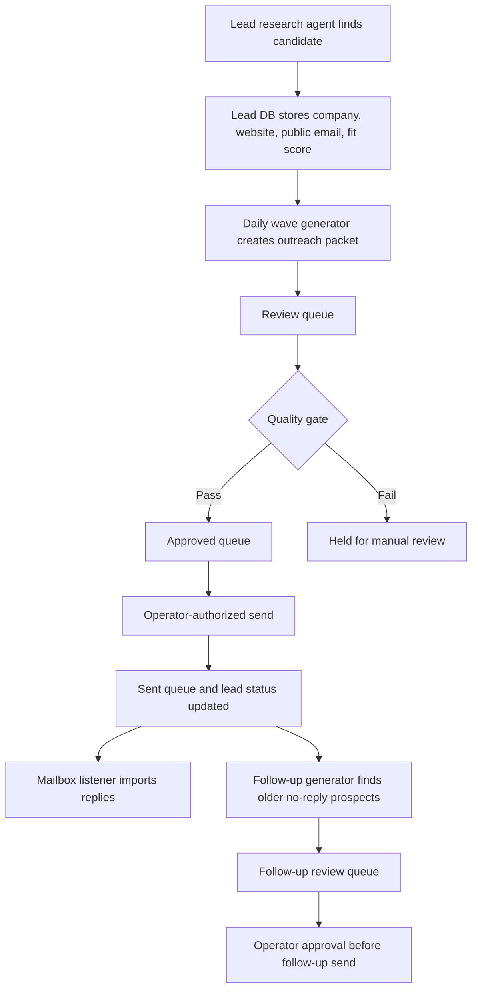

# JVT Lead-To-Follow-Up Workflow Map

Updated: 2026-05-20

## Purpose

This is the proof asset for the workflow automation cleanup offer. It maps JVT's own lead pipeline from research through follow-up so the service can be sold as a fixed-scope cleanup project.

## Current Flow

## Bottlenecks Found

- Lead research can create page-title names that look plausible until quality review.
- Approved packets need a stricter pre-send gate, not just human trust in the queue.
- Follow-ups were not tracked as a separate lifecycle until now.
- Public offer pages were missing for the new service wedges, so outreach had too much document-assistant framing.

## Cleanup Already Added

- Approved-queue quality gate.
- Follow-up generator with no-reply age threshold.
- Follow-up review queue.
- Watchdog status in the control panel.
- Public AI receptionist and meeting-to-action demo pages.

## Fixed-Scope Client Offer

For a client, this maps to a one-workflow cleanup:

- Document the current intake or admin workflow.
- Define the allowed states and owner handoffs.
- Add quality gates before customer-facing output.
- Add a dashboard or queue view.
- Add a small follow-up or reminder loop with human approval.

## Pricing Hypothesis

`$1,500` fixed project for one workflow, with support quoted separately after the first working version.
